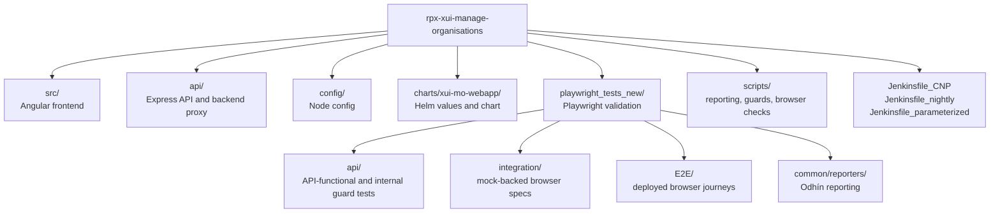
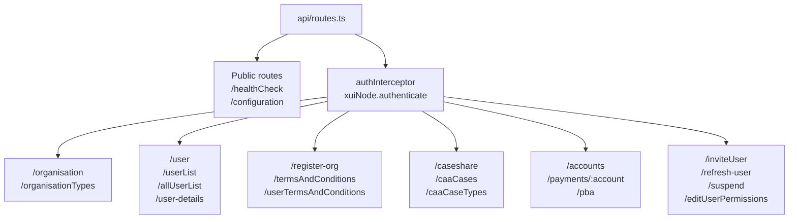
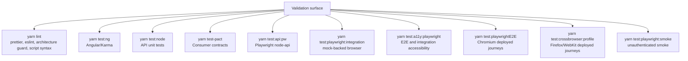
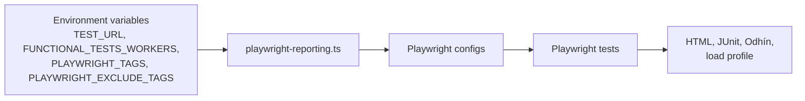
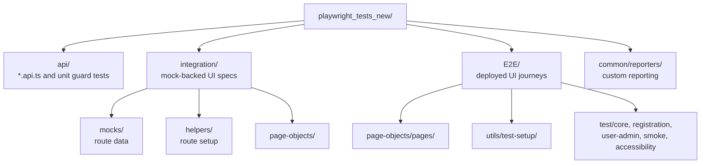
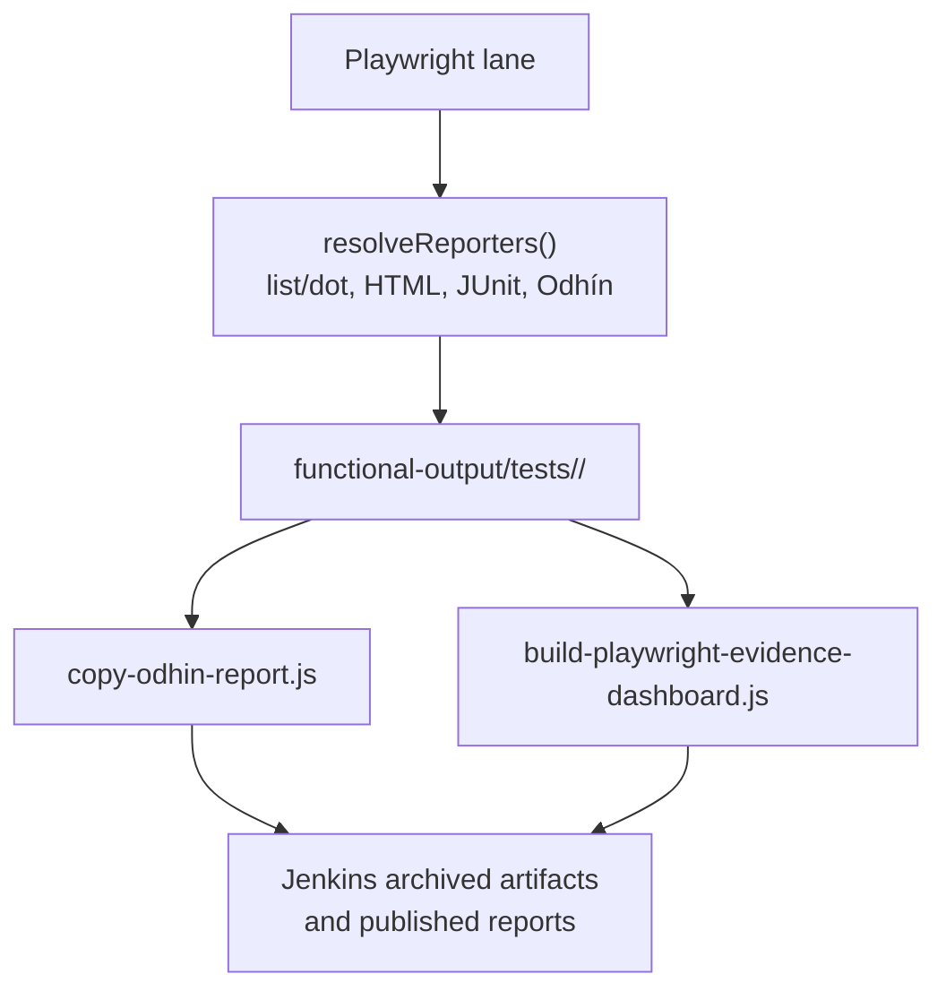
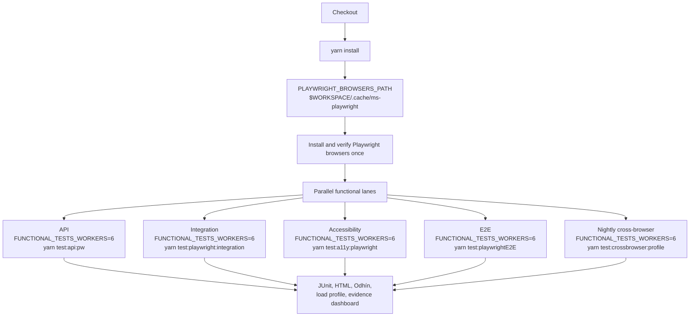

# RPX XUI Manage Organisations

This repo contains the Manage Organisations Angular frontend and Node API.

## Prerequisites

- Connect to the HMCTS VPN before calling shared environments.
- Use the Node version declared in `package.json`.
- Populate local secrets before running the full local stack.

## Repository Map

This is a single application repo with an Angular frontend, an Express/Node API, Helm chart deployment config, and Playwright validation suites.



Key areas:

| Area                                | Purpose                                                                                                 |
| ----------------------------------- | ------------------------------------------------------------------------------------------------------- |
| `src/`                              | Angular UI, feature modules, guards, services, stores, shared components and assets.                    |
| `api/`                              | Express routes, service adapters, auth/session handling, health checks, Pact tests and Node unit tests. |
| `config/`                           | Runtime configuration loaded by Node config.                                                            |
| `charts/xui-mo-webapp/`             | Helm chart and environment values used by deployment.                                                   |
| `playwright_tests_new/api/`         | Playwright API-functional tests plus unit-style tests for Playwright support code and repo guardrails.  |
| `playwright_tests_new/integration/` | Mock-backed Playwright browser specs with local route fixtures and deterministic mocks.                 |
| `playwright_tests_new/E2E/`         | Deployed-environment browser journeys and page objects.                                                 |
| `scripts/`                          | Playwright evidence dashboard, Odhín helpers, a11y runner, browser verification and architecture guard. |
| `Jenkinsfile_*`                     | CNP, nightly and parameterized Jenkins lanes.                                                           |

## How the App Hangs Together

The local frontend runs on port `3000`. `proxy.config.json` sends `/api`, `/auth`, `/external`, `/health`, and `/oauth2/callback` traffic to the Node API on port `3001`.

```mermaid
flowchart LR
  Browser["Browser\nhttp://localhost:3000"]
  Angular["Angular app\nsrc/"]
  Proxy["Angular dev proxy\nproxy.config.json"]
  Node["Node API\napi/application.ts + api/routes.ts"]
  Auth["Auth middleware\nxuiNode.authenticate"]
  Services["Service adapters\nIDAM, PRD, CCD, Payments, S2S"]
  External["HMCTS platform services"]

  Browser --> Angular
  Angular -->|"frontend routes and assets"| Browser
  Angular -->|"/api /auth /external /health"| Proxy
  Proxy --> Node
  Node --> Auth
  Auth --> Services
  Services --> External
```



The API route table is registered in `api/routes.ts`. Public health/configuration routes are available before auth, then protected business routes go through the auth middleware and `xuiNode.authenticate`.



## Local Development

Start the Angular frontend:

```bash
yarn start:ng
```

Start the Node API proxy in a separate terminal:

```bash
yarn start:node
```

Open `http://localhost:3000/`. The frontend reloads when source files change.

## Code Scaffolding

Run `ng generate component component-name` to generate a new component. You can also use `ng generate directive|pipe|service|class|guard|interface|enum|module`.

## Build

Run `ng build` to build the project. The build artifacts will be stored in the `dist/` directory. Use the `--prod` flag for a production build.

## Unit Tests

Run `ng test` to execute the unit tests via [Karma](https://karma-runner.github.io).

## Integration Documentation

[EXUI Low Level Design](https://tools.hmcts.net/confluence/display/EUI/EXUI+Low+Level+Design)

## Pact Tests

Run the consumer-driven contract tests:

```bash
yarn test-pact
```

Publish pacts to the broker:

```bash
yarn publish-pact
```

## Test Strategy

The repo now uses Playwright as the functional gate. The old Codecept, legacy API-functional, old `playwright_tests`, backend mock and pa11y command surface has been removed.



Playwright is split by test intent:

| Lane           | Config                                     | Scope                                                              | Default target                                        |
| -------------- | ------------------------------------------ | ------------------------------------------------------------------ | ----------------------------------------------------- |
| API functional | `playwright.config.ts`, project `node-api` | API contracts, guard rails, internal support tests                 | `TEST_URL` or `http://localhost:3000/` in base config |
| Integration    | `playwright.integration.config.ts`         | Mock-backed browser tests under `playwright_tests_new/integration` | `TEST_URL` or AAT                                     |
| E2E            | `playwright.e2e.config.ts`                 | Deployed Chromium journeys under `playwright_tests_new/E2E`        | `TEST_URL` or AAT                                     |
| Cross-browser  | `playwright-nightly.config.ts`             | Firefox/WebKit deployed journeys                                   | `TEST_URL` or AAT                                     |
| Smoke          | `playwright.config.ts`, project `smoke`    | Unauthenticated login and protected-route checks                   | `TEST_URL` or local                                   |
| Accessibility  | `scripts/run-playwright-a11y.js`           | Dedicated `@a11y` specs across E2E and integration                 | `TEST_URL` or AAT                                     |

All Playwright configs use `playwright-reporting.ts` for worker count, reporter selection, tag filtering, and output directories.



The Playwright folder layout is:



Keep helpers close to their lane:

- API-only support belongs under `playwright_tests_new/api`.
- Mock-backed route setup belongs under `playwright_tests_new/integration/helpers`.
- Integration mock data belongs under `playwright_tests_new/integration/mocks`.
- E2E setup helpers belong under `playwright_tests_new/E2E/utils/test-setup`.
- Page objects should model user actions. Assertions should stay in specs or API tests.

## Playwright Reporting

Playwright writes lane-specific evidence under `functional-output/tests`. The main reports are:

- Smoke: `functional-output/tests/playwright-smoke/odhin-report/xui-playwright-smoke.html`
- E2E: `functional-output/tests/playwright-e2e/odhin-report/xui-playwright-e2e.html`
- API: `functional-output/tests/playwright-api/odhin-report/xui-mo-playwright-api.html`
- System load:
  - API: `functional-output/tests/playwright-api/odhin-report/load-profile/load-profile.html`
  - Integration: `functional-output/tests/playwright-integration/odhin-report/load-profile/load-profile.html`
  - E2E and nightly cross-browser: `functional-output/tests/playwright-e2e/odhin-report/load-profile/load-profile.html`
- Evidence dashboard: `functional-output/tests/manage-org-evidence/index.html`

- Run info includes project, release, target environment, branch, worker count, CPU cores, and RAM.
- System-load reports are generated by `scripts/playwright-load-monitor.js` and published in Jenkins as `System Load` HTML reports for API, integration, and E2E/cross-browser lanes.
- Branch defaults to the current git branch and can be overridden with `PLAYWRIGHT_REPORT_BRANCH` or `GIT_BRANCH`.
- Report metadata can be overridden with `PLAYWRIGHT_REPORT_PROJECT`, `PLAYWRIGHT_REPORT_RELEASE`, `PLAYWRIGHT_REPORT_TEST_ENVIRONMENT`, `PLAYWRIGHT_REPORT_FOLDER`, `PLAYWRIGHT_REPORT_INDEX_FILENAME`, `PLAYWRIGHT_HTML_OUTPUT`, and `PLAYWRIGHT_JUNIT_OUTPUT`.
- Existing `PW_ODHIN_*` overrides are still supported for backward compatibility.
- Jenkins publishes lane-specific JUnit XML from `functional-output/tests/playwright-smoke/**`, `functional-output/tests/playwright-api/**`, `functional-output/tests/playwright-integration/**`, `functional-output/tests/playwright-a11y/**`, and `functional-output/tests/playwright-e2e/**`.
- Jenkins archives the lane output folders and publishes the evidence dashboard after the Playwright lanes finish.
- `yarn test:smoke` is the Jenkins CNP smoke entrypoint. It covers unauthenticated login and protected-route redirects.
- `yarn test:playwrightE2E` is the Jenkins CNP Chromium E2E entrypoint. It wraps `playwright.e2e.config.ts` with the system-load monitor.
- `yarn test:crossbrowser:profile` is the Jenkins nightly Firefox/WebKit entrypoint. It wraps `playwright-nightly.config.ts` with the system-load monitor.
- `yarn test:api:pw` runs the Playwright `node-api` project. It covers organisation details, user/session context, user lists, public configuration/reference data, protected-route guard rails, invite, re-invite, and register-organisation API coverage. Mutating invite and registration POST checks are present but disabled by default unless their lifecycle has been agreed.
- Run `yarn report:playwright:evidence` locally to create the same dashboard from whatever reports are present under `functional-output/tests`.
- `PLAYWRIGHT_TAGS` runs only matching Playwright tags, for example `PLAYWRIGHT_TAGS=@registration yarn test:playwrightE2E`.
- `PLAYWRIGHT_EXCLUDE_TAGS` removes matching Playwright tags, for example `PLAYWRIGHT_TAGS=@e2e PLAYWRIGHT_EXCLUDE_TAGS=@e2e-smoke yarn test:playwrightE2E -- --list`.

The reporting flow is:



## Local Test Lanes

Use these commands when you need to prove the branch locally. Set `PLAYWRIGHT_SKIP_INSTALL=true` when the Playwright browsers are already installed. Without that flag, raw Chromium lanes install Chromium before running.

Local Playwright workers default to computed machine parallelism, capped at 10. Set `FUNCTIONAL_TESTS_WORKERS` when you need an explicit worker count.

| Lane                         | Command                                                         |
| ---------------------------- | --------------------------------------------------------------- |
| Lint and architecture guards | `yarn lint`                                                     |
| API functional               | `PLAYWRIGHT_SKIP_INSTALL=true yarn test:api:pw`                 |
| Mock-backed integration      | `PLAYWRIGHT_SKIP_INSTALL=true yarn test:playwright:integration` |
| Accessibility                | `PLAYWRIGHT_SKIP_INSTALL=true yarn test:a11y:playwright`        |
| Chromium E2E                 | `PLAYWRIGHT_SKIP_INSTALL=true yarn test:playwrightE2E`          |
| Nightly cross-browser        | `PLAYWRIGHT_SKIP_INSTALL=true yarn test:crossbrowser:profile`   |
| Smoke                        | `yarn test:playwright:smoke`                                    |

Run the full local Playwright pack in the same order as the deployed lanes:

```bash
yarn test:playwright:smoke
PLAYWRIGHT_SKIP_INSTALL=true yarn test:api:pw
PLAYWRIGHT_SKIP_INSTALL=true yarn test:playwright:integration
PLAYWRIGHT_SKIP_INSTALL=true yarn test:a11y:playwright
PLAYWRIGHT_SKIP_INSTALL=true yarn test:playwrightE2E
PLAYWRIGHT_SKIP_INSTALL=true yarn test:crossbrowser:profile
```

To mirror Jenkins worker pressure, set `FUNCTIONAL_TESTS_WORKERS=6`:

```bash
FUNCTIONAL_TESTS_WORKERS=6 yarn test:playwright:smoke
FUNCTIONAL_TESTS_WORKERS=6 PLAYWRIGHT_SKIP_INSTALL=true yarn test:api:pw
FUNCTIONAL_TESTS_WORKERS=6 PLAYWRIGHT_SKIP_INSTALL=true yarn test:playwright:integration
FUNCTIONAL_TESTS_WORKERS=6 PLAYWRIGHT_SKIP_INSTALL=true yarn test:a11y:playwright
FUNCTIONAL_TESTS_WORKERS=6 PLAYWRIGHT_SKIP_INSTALL=true yarn test:playwrightE2E
FUNCTIONAL_TESTS_WORKERS=6 PLAYWRIGHT_SKIP_INSTALL=true yarn test:crossbrowser:profile
```

Install or verify browsers explicitly when you need to reset local browser state:

```bash
yarn test:setup:playwright-install-chromium
yarn test:setup:playwright-verify-chromium
yarn test:setup:playwright-install-all
yarn test:setup:playwright-verify-all
```

## Jenkins Test Lanes

Jenkins installs dependencies, installs Playwright browsers once into a workspace-local cache, verifies the browser install, and then runs the functional lanes with `PLAYWRIGHT_SKIP_INSTALL=true`.



The important CI contract is:

- Browser install happens once per Jenkins workspace.
- Functional lanes use the shared `PLAYWRIGHT_BROWSERS_PATH`.
- Functional lanes set `PLAYWRIGHT_SKIP_INSTALL=true`, so they do not reinstall Chromium.
- API, integration, E2E, and nightly cross-browser lanes publish a `System Load` HTML report from `load-profile.html`.
- Jenkins worker pressure is fixed at `FUNCTIONAL_TESTS_WORKERS=6`.
- Local runs compute worker count from the developer machine unless `FUNCTIONAL_TESTS_WORKERS` is set.

## Playwright Tag Policy

Every migrated Playwright journey should have one execution-pack tag and one domain tag.

- Execution-pack tags:
  - `@e2e` for end-to-end journeys.
  - `@e2e-smoke` for unauthenticated login and protected-route redirect smoke checks.
  - `@a11y` for dedicated accessibility scans. `*.a11y.spec.ts` files are ignored by normal E2E and integration runs unless `PLAYWRIGHT_INCLUDE_A11Y=true`.
- Domain tags:
  - `@registration` for register organisation and register other organisation journeys.
  - `@organisation` for organisation details and organisation profile journeys.
  - `@user-admin` for users, invite, suspend, permissions, and re-invite journeys.
  - `@auth` for deployed authentication and sign-out journeys.
  - `@terms` for terms-and-conditions route and content checks.
  - `@api` for Playwright API-functional coverage.
  - `@integration` for Playwright mock-backed integration coverage.

Jenkins CNP, nightly, and parameterized E2E stages set `PLAYWRIGHT_TAGS=@e2e` and exclude `@a11y`. Accessibility stays in `yarn test:a11y:playwright`. API and integration lanes use their dedicated Playwright projects, so E2E tag filtering does not remove them.

## Legacy Codecept Retirement

Playwright API, integration, accessibility, and E2E lanes are now the Manage Organisations functional gates.

- Retired package aliases have been removed. That includes `test:functional`, `test:fullfunctional`, `test:api`, `test:codeceptE2E`, `test:a11yInTest`, `test:xuiIntegration`, `test:backendMock`, `test:ngIntegrationMockEnv`, `patch:static`, `testx`, and the placeholder mutation scripts.
- `yarn test:a11y:playwright` runs the deployed E2E route scans and discovers the mocked integration case-sharing accessibility specs. Those integration specs stay skipped until the product accessibility fixes are delivered in a separate application PR.
- Retired legacy assets have been deleted from the active tree: `test_codecept/**`, old `playwright_tests/**`, legacy pa11y accessibility tests, old API-functional tests, and old local mock assets. Historical evidence is available from git history and the migration Jira trail.
- `test/java/**` remains because Fortify still owns that Java wrapper; it is not part of the retired functional framework estate.
- `yarn lint:playwright:architecture` fails if package scripts, Jenkinsfiles, dependencies, legacy folders, old report publishers, or old Playwright paths are reintroduced.
- Live mutating invite, re-invite, and register-organisation API POST probes are not part of default CNP/nightly because they create persistent AAT data; use `yarn test:api:pw:mutating` only when the target environment and cleanup window are agreed.

## Playwright Authentication

Populate local Playwright credentials from Key Vault, or provide secure local values yourself:

```bash
yarn env:populate:aat
```

This reads `.env.example`, pulls tagged secrets from the `rpx-aat` Key Vault, and writes `.env`. Use `yarn env:populate:demo` for demo, or pass explicit files when you need a custom output:

```bash
bash ./scripts/populate-env-from-keyvault.sh aat .env .env.example
```

Before running it, sign in to Azure with access to the target vault:

```bash
az login
az account set --subscription <subscription-name-or-id>
```

Required Playwright values in `.env` are `TEST_USER1_EMAIL`, `TEST_USER1_PASSWORD`, `TEST_ROO_EMAIL`, `TEST_ROO_PASSWORD`, and `TEST_URL`.

The populate script also normalises common aliases used by the app and tests, including `CLIENT_ID` / `IDAM_CLIENT`, IDAM service URLs, `S2S_SERVICE`, and the default dynamic organisation user credentials.

- `MANAGE_ORG_TEST_USER_ROLE` selects the signed-in fixture user: `base` by default, or `roo`.
- `MANAGE_ORG_STORAGE_STATE` can point to a local directory for generated worker-isolated storage-state files.
- `MANAGE_ORG_API_ENABLE_INVITE_POST=true` enables the mutating invite / re-invite API POST test. Keep it disabled unless the target environment and test-user lifecycle are agreed.
- `MANAGE_ORG_API_ENABLE_REGISTRATION_POST=true` enables the mutating register-organisation API POST test. Keep it disabled unless the target environment and data lifecycle are agreed.
- Smoke/login tests stay unauthenticated by default. Only tests that request `signedInPage` load cached auth state.
- Use `yarn test:playwrightE2E:list` to confirm the CNP Playwright E2E pack.
- Use `yarn test:playwright:smoke:list` to list unauthenticated smoke checks, or `yarn test:playwright:smoke` to run them.

## Further Help

To get more help on the Angular CLI use `ng help` or go and check out the [Angular CLI README](https://github.com/angular/angular-cli/blob/master/README.md).

## Logger Errors and Warnings

Extended version of script below:

(https://robferguson.org/blog/2017/09/09/a-simple-logging-service-for-angular-4/)

## Branches, Environment and Deployment Methods

```javascript
 |---------------------------------------|
 | Branch | Environment | Deployment via |
 |---------------------------------------|
 | local  | development | -              |
 | PR     | preview     | Jenkins        |
 | Master | aat         | Jenkins        |
 | Master | aat         | Flux           |
 | Master | ithc        | Flux           |
 | Master | production  | Flux           |
 |---------------------------------------|
```

## Configuration Path

The application uses the Node `config` package. The current repo has these configuration files:

| File                                        | Purpose                                                                 |
| ------------------------------------------- | ----------------------------------------------------------------------- |
| `config/default.json`                       | Default application configuration.                                      |
| `config/custom-environment-variables.json`  | Maps environment variables onto config keys.                            |
| `config/local-development.json`             | Local development overrides.                                            |
| `config/pacttesting.json`                   | Pact test configuration.                                                |

Avoid adding new files under `config/` unless there is a clear environment or test-mode reason. Prefer environment variables, Helm values, or an existing config file first.

## Environment

`NODE_ENV_CONFIG=local` will turn on tunneling on a local environment.

## Setting Up Secrets Locally

You need to setup secrets locally before you run the project. Why? - When you push this application
up through AKS deployed through Flux to AAT, ITHC and Prod, the application will take in the secrets on these environments.

The developer needs to set these up locally, so that the developer can see any issues early in
the development process, and not when the application is placed up onto the higher AKS environments.

To setup the secrets locally do the following:

Note that Mac OS Catalina introduced a new feature that overlaps and reinforces the filesystem,
therefore you will not be able to make changes in the root directory of your file system, hence there are different
ways to setup secrets, Pre Catalina and Post Catalina, note that the Post Catalina way should work
for all operating system, but I have yet to try this.

#### Mac OS - Pre Catalina

1. Create a Mount point on your local machine<br/>
   Create the folder: `/mnt/secrets/rpx`
2. In this folder we create a file per secret.
   ie.
   We create the file postgresql-admin-pw (no extension).
   Within the file we have one line of characters which is the secret.

#### Mac OS - Post Catalina

1. Create a Mount point on your local machine within the Volumes folder<br/>
   Create the folder: `/Volumes/mnt/secrets/rpx`
2. In this folder we create a file per secret.
   ie.
   We create the file postgresql-admin-pw (no extension).
   Within the file we have one line of characters which is the secret.
3. If you want to test the secrets locally override the default mountPoint with the following additional option added to .addTo
   ie.
   `propertiesVolume.addTo(secretsConfig, { mountPoint: '/Volumes/mnt/secrets/' });`

Note that this is connected into the application via the following pieces of code:

```yaml
keyVaults:
  rpx:
    secrets:
      - postgresql-admin-pw
      - appinsights-connection-string-mo
```

which in turn uses `propertiesVolume.addTo()`

## How Application Configuration Works

The application reads `/config/*.json` through the Node `config` package and overlays values from environment variables declared in `config/custom-environment-variables.json`.

Deployment values live in `charts/xui-mo-webapp/values.yaml`. Jenkins can also use `values.*.template.yaml` files while building Preview and AAT releases; AKS consumes the rendered chart values rather than those Jenkins templates directly.

Do not add secrets to `/config/*.json`. Keep secrets in Key Vault and map them through chart values and mounted files.

Node config selects the file within /config based on `NODE_ENV` which is always production on all environments,
due to Reform standards, this should not change on different environments, it should always be `NODE_ENV=production`

Note that I'm currently leveraging `NODE_CONFIG_ENV` which passes in the environment as we have a database password on
the preview environment that cannot be stored within any of our configuration files, as this is an open repo,
and the same password is being used on AAT.

In other projects we will not need to leverage `NODE_CONFIG_ENV`.

Note about secrets ie.

```yaml
keyVaults:
  rpx:
    secrets:
      - postgresql-admin-pw
      - appinsights-connection-string-mo
```

are set within the values.yaml and there should be NO REFERENCE to them within any `/config/*.json` file.

The application pulls out the secrets directly using `propertiesVolume.addTo()`

## Session Timeout

The applications Session Timeouts are set via configuration and can be overridden, please @see default.json
and @see .env.defaults.

Example configuration:

```javascript
SESSION_TIMEOUTS = [
  { idleModalDisplayTime: 6, pattern: 'pui-', totalIdleTime: 55 },
  { idleModalDisplayTime: 3, pattern: 'caseworker-', totalIdleTime: 30 },
  { idleModalDisplayTime: 6, pattern: '.', totalIdleTime: 60 },
];
```

Note that the wildcard Reg Ex '.' pattern seen in the following sets the applications default.

```javascript
{ "idleModalDisplayTime": 6, "pattern": ".", "totalIdleTime": 60 }
```

Each Session Timeout object accepts a Reg Ex pattern, which sets the Session Timeout for that User group.

Jargon used:

Session Timeout Modal - The modal popup that appears BEFORE the users Total Idle Time is over.

Total Idle Time - The Users total idle time, this includes time in which we show the Session Timeout Modal to the User.

Idle Modal Display Time - The time we display the Session Timeout Modal for.

Session Timeout Configuration - An array that contains the Applications and User Groups session timeout times.

Session Timeout - An object that contains the Idle Modal Display Time, Reg Ex pattern so that we use
the correct Session Timeout for the application / and or User Groups and Total Idle Time.

END
